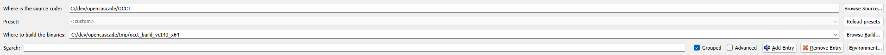
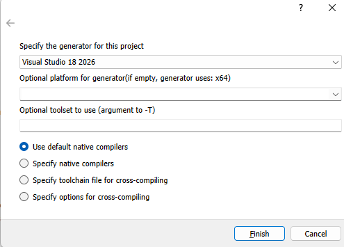
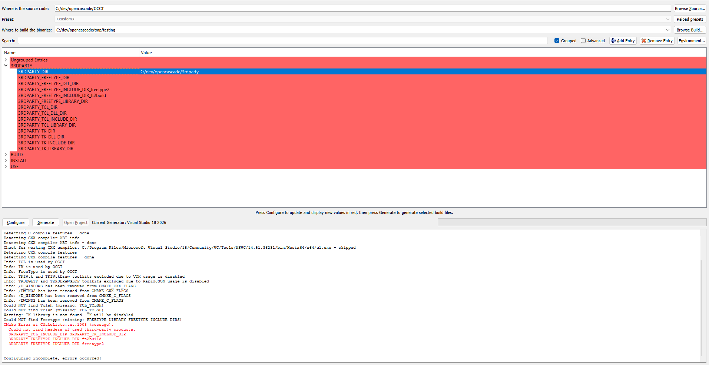
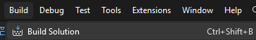
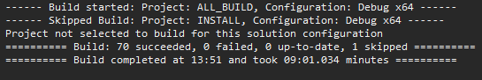
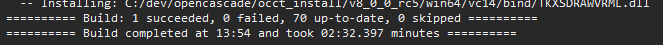
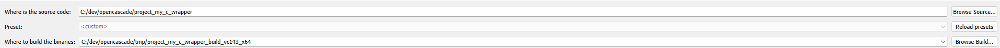
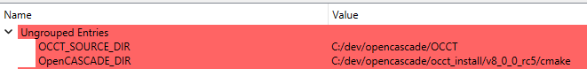
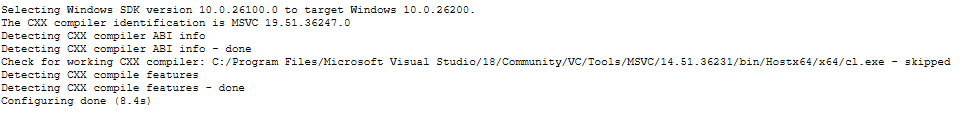
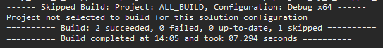

# My OCCT C Wrapper

`my_occt_c_wrapper` is a small C ABI wrapper around selected Open CASCADE
Technology (OCCT) operations used by the Pharo MyCAD/OpenCascade integration.

The wrapper exists so Pharo talks to a stable C interface through UFFI instead
of binding directly to C++ OCCT classes. It owns the native lifetime rules,
shape handles, tessellation buffers, topology queries, transforms, BREP import
and export, and boolean operations exposed in `src/my_c_wrapper.h`.

## Responsibility Boundary

- `src/my_c_wrapper.h` is the public ABI contract.
- `src/my_c_wrapper.cpp` owns the OCCT C++ calls and native memory management.
- `CMakeLists.txt` owns native build configuration and OCCT linkage.
- Pharo classes such as `CxxOcctLibrary`, `MyShape`, and `MyBoxMaker` consume
  this library. They should not know how OCCT is built.

For application developers, this wrapper is a native runtime dependency. For
wrapper contributors, this repository is the source project used to build that
runtime dependency.

## Supported Platforms

Current supported runtime target:

- Windows x64

Other platforms should be treated as source-build targets until precompiled
runtime archives are provided for them.

## Using The Built Wrapper In Pharo

A precompiled runtime archive for quick setup.

Expected runtime archive layout:

```text
bin/
  my_occt_c_wrapper.dll
  <required OCCT runtime DLLs>
include/
  my_c_wrapper.h
LICENSES/
  <project license>
  <OCCT license files>
README-runtime.md
```

To use the wrapper with Pharo on Windows:

1. Download or build a matching `windows-x64` runtime archive.
2. Extract the archive.
3. Copy everything from `bin/` into the Pharo image directory, beside the
   `.image` file.
4. Start Pharo.
5. Load the MyCAD/OpenCascade Smalltalk packages.
6. Run a smoke test that creates a primitive shape.

If Pharo reports that `my_occt_c_wrapper.dll` cannot be found, either the
wrapper DLL is not in Pharo's native library search path or one of the OCCT
runtime DLLs beside it is missing.

## Building From Source

Build from source when changing the native wrapper or recreating the development
runtime DLLs.

### Prerequisites

- Windows x64
- Visual Studio with C++ support
- CMake 3.24 or newer
- CMake GUI, if you prefer configuring visually
- An OCCT source archive and third-party dependency archives

The current project expects OCCT 8.0.0 release-candidate compatible libraries.
If you build against a different OCCT version, publish that version in the
release notes because the runtime DLL set may change.

The examples below use this working directory:

```text
C:\dev\opencascade
```

You can use another directory, but keep the same structure so the paths are easy
to translate.

### Directory Layout

Before building, the directory should end up looking like this:

```text
C:\dev\opencascade
|-- project_my_c_wrapper
|   |-- CMakeLists.txt
|   |-- README.md
|   `-- src
|       |-- my_c_wrapper.cpp
|       `-- my_c_wrapper.h
|-- OCCT
|   |-- CMakeLists.txt
|   |-- adm
|   |-- src
|   `-- ...
|-- 3rdparty
|   |-- freetype-2.5.5-vc14-64.zip
|   |-- freetype-2.5.5-vc14-64
|   |-- rapidjson-1.1.0.zip
|   |-- rapidjson-1.1.0
|   |-- tcltk-86-64.zip
|   `-- tcltk-86-64
|-- tmp
|   |-- occt_build_vc143_x64
|   `-- project_my_c_wrapper_build_vc143_x64
`-- occt_install
    `-- v8_0_0_rc5
```

The important rule is that `project_my_c_wrapper` is the wrapper source,
`OCCT` is the downloaded OCCT source, `3rdparty` contains OCCT dependencies,
`tmp` contains generated build files, and `occt_install` is the installed OCCT
runtime used by the wrapper.

### 1. Prepare The Project Directory

Create the working directories:

```powershell
mkdir C:\dev\opencascade
mkdir C:\dev\opencascade\3rdparty
mkdir C:\dev\opencascade\tmp
```

After that, the root directory is:

```text
C:\dev\opencascade
```

Put this wrapper project inside that directory:

```text
C:\dev\opencascade\project_my_c_wrapper
```

The wrapper project root should contain:

```text
project_my_c_wrapper
|-- CMakeLists.txt
|-- README.md
`-- src
    |-- my_c_wrapper.cpp
    `-- my_c_wrapper.h
```

### 2. Download OCCT Dependencies

The dependency directory created above is:

```text
C:\dev\opencascade\3rdparty
```

Download and extract these archives:

| Dependency | Download URL | Extract To |
|---|---|---|
| freetype | `https://dev.opencascade.org/system/files/occt/3rdparty/freetype-2.5.5-vc14-64.zip` | `C:\dev\opencascade\3rdparty\freetype-2.5.5-vc14-64` |
| rapidjson | `https://dev.opencascade.org/system/files/occt/3rdparty/rapidjson-1.1.0.zip` | `C:\dev\opencascade\3rdparty\rapidjson-1.1.0` |
| tcltk | `https://dev.opencascade.org/system/files/occt/3rdparty/tcltk-86-64.zip` | `C:\dev\opencascade\3rdparty\tcltk-86-64` |

After extraction, each dependency folder should contain its files directly. For
example, this is correct:

```text
C:\dev\opencascade\3rdparty\freetype-2.5.5-vc14-64\include
```

This is usually wrong because it has an extra nested folder:

```text
C:\dev\opencascade\3rdparty\freetype-2.5.5-vc14-64\freetype-2.5.5-vc14-64\include
```

### 3. Download OCCT Source

Download the OCCT source archive:

```text
https://github.com/Open-Cascade-SAS/OCCT/archive/refs/tags/V8_0_0_rc5.zip
```

Save it under:

```text
C:\dev\opencascade
```

Extract it, then rename the extracted `OCCT-8_0_0_rc5` folder to:

```text
C:\dev\opencascade\OCCT
```

The folder passed to CMake must contain OCCT's own `CMakeLists.txt` file.

### 4. Configure OCCT In CMake GUI

Open **CMake GUI**.

This step builds OCCT itself, so the source folder must be the extracted OCCT
source directory, not `project_my_c_wrapper`.

#### 4.1 Set The OCCT Source And Build Folders

At the top of CMake GUI, set these two fields:

```text
Where is the source code:
C:/dev/opencascade/OCCT

Where to build the binaries:
C:/dev/opencascade/tmp/occt_build_vc143_x64
```



Click **Configure**.


When CMake asks for a generator, choose:

```text
Visual Studio 18 2026
```

Leave the optional platform field blank, and use the default native compilers.
Then click **Finish**.



The first configure pass may show errors. That is expected because CMake has
not been told where the OCCT third-party dependencies are yet.

#### 4.2 Set The Third-Party Directory First

Keep **Grouped** enabled so the OCCT settings are easier to find.


After the first configure pass, the output panel may report missing products
such as freetype, TCL, and TK. This is the screen where you tell CMake where
the third-party folder is.



In the settings table, open the `3RDPARTY` group.

Set:

```text
3RDPARTY_DIR
C:/dev/opencascade/3rdparty
```

Do not fill the individual freetype, rapidjson, TCL, or TK rows by hand first.
Set only `3RDPARTY_DIR`, then click **Configure** again.

After this configure pass, CMake should fill paths such as:

```text
3RDPARTY_FREETYPE_DIR
3RDPARTY_FREETYPE_DLL_DIR
3RDPARTY_FREETYPE_INCLUDE_DIR_freetype2
3RDPARTY_RAPIDJSON_DIR
3RDPARTY_TCL_DIR
3RDPARTY_TCL_DLL_DIR
3RDPARTY_TK_DIR
3RDPARTY_TK_DLL_DIR
```

Rows shown in red are CMake values that were added or changed during configure.
They are not necessarily errors. Check the output panel at the bottom for the
actual error message.

If CMake still reports missing freetype, TCL, or TK after this configure pass,
check that the dependency folders are not double-nested. For example, this is
correct:

```text
C:/dev/opencascade/3rdparty/freetype-2.5.5-vc14-64/include
```

This is usually wrong:

```text
C:/dev/opencascade/3rdparty/freetype-2.5.5-vc14-64/freetype-2.5.5-vc14-64/include
```

#### 4.3 Set The OCCT Build And Install Options

The first screen in this step shows the `3RDPARTY` and `BUILD` groups.


In the `3RDPARTY` group, verify that CMake filled paths for freetype,
rapidjson, TCL, and TK. If those paths are still empty, go back to step 4.2 and
configure again after setting `3RDPARTY_DIR`.

In the `BUILD` group, enable:

```text
BUILD_USE_PCH
```

Keep the default OCCT modules enabled unless you know you do not need them:

```text
BUILD_MODULE_ApplicationFramework
BUILD_MODULE_DataExchange
BUILD_MODULE_Draw
BUILD_MODULE_FoundationClasses
BUILD_MODULE_ModelingAlgorithms
BUILD_MODULE_ModelingData
BUILD_MODULE_Visualization
```

You do not need to enable these optional build settings for this wrapper:

```text
BUILD_DOC_Overview
BUILD_DOC_RefMan
BUILD_RESOURCES
BUILD_WITH_DEBUG
BUILD_YACCLEX
```

The second screen in this step shows the `INSTALL` and `USE` groups.


In the `INSTALL` group, set:


```text
INSTALL_DIR
C:/dev/opencascade/occt_install/v8_0_0_rc5
```

Then enable:

```text
INSTALL_FREETYPE
INSTALL_TCL
INSTALL_TK
```

In the `USE` group, enable:

```text
USE_FREETYPE
USE_RAPIDJSON
USE_TCL
USE_TK
```

Leave these optional integrations disabled unless you intentionally need them:

```text
USE_VTK
USE_OPENVR
USE_FFMPEG
USE_FREEIMAGE
```

Click **Configure** again.

If there are no blocking errors in the output panel, click **Generate**.


The generated Visual Studio solution will be in:

```text
C:\dev\opencascade\tmp\occt_build_vc143_x64
```

Click **Open Project** to open the generated solution in Visual Studio 2026.


### 5. Build And Install OCCT

If Visual Studio did not open automatically, open this solution file:

```text
C:\dev\opencascade\tmp\occt_build_vc143_x64\OCCT.slnx
```

In Visual Studio 2026, check the toolbar:

```text
Configuration: Debug
Platform: x64
Solution: OCCT
```


Open the **Build** menu and click **Build Solution**.



The OCCT build can take several minutes. A successful build should end with
output similar to:

```text
Build: 70 succeeded, 0 failed, 0 up-to-date, 1 skipped
```



After the solution build succeeds, install OCCT into the `INSTALL_DIR` selected
in CMake.

In Solution Explorer, find the `INSTALL` target, right-click it, and click
**Build**.


A successful install should end with output similar to:

```text
Build: 1 succeeded, 0 failed, 70 up-to-date, 0 skipped
```



After installation, OCCT should be available under:

```text
C:\dev\opencascade\occt_install\v8_0_0_rc5
```

The important file for the wrapper build is:

```text
C:\dev\opencascade\occt_install\v8_0_0_rc5\cmake\OpenCASCADEConfig.cmake
```

For this guide, use this directory later as `OpenCASCADE_DIR` when configuring
the C wrapper:

```text
C:\dev\opencascade\occt_install\v8_0_0_rc5\cmake
```

If that path does not exist, search inside `C:\dev\opencascade\occt_install`
for `OpenCASCADEConfig.cmake`, then use the folder that contains that file.

### 6. Configure The C Wrapper

This step configures the C wrapper project, not OCCT itself.

For a first-time setup, use CMake GUI because it shows the paths clearly.

Set:

```text
Where is the source code:
C:/dev/opencascade/project_my_c_wrapper

Where to build the binaries:
C:/dev/opencascade/tmp/project_my_c_wrapper_build_vc143_x64
```



Click **Configure**.


When CMake asks for a generator:

```text
Generator:
Visual Studio 18 2026

Optional platform:
leave blank

Compiler option:
Use default native compilers
```

Then click **Finish**.


After the first configure pass, check these cache entries:

```text
OCCT_SOURCE_DIR:
C:/dev/opencascade/OCCT

OpenCASCADE_DIR:
C:/dev/opencascade/occt_install/v8_0_0_rc5/cmake
```

`OpenCASCADE_DIR` is the important one. It must point to the directory that
contains `OpenCASCADEConfig.cmake`.

`OCCT_SOURCE_DIR` is only used to show OCCT source files in the generated Visual
Studio project for debugging. If you want that source grouping, point it to the
extracted OCCT source folder:

```text
C:/dev/opencascade/OCCT
```



Click **Configure** again. The output should end with `Configuring done`.



When the current generator shows `Visual Studio 18 2026`, click **Generate**.


The generated Visual Studio solution will be in:

```text
C:\dev\opencascade\tmp\project_my_c_wrapper_build_vc143_x64
```

Click **Open Project** to open the generated wrapper solution in Visual Studio
2026.


If Visual Studio does not open automatically, open this solution file:

```text
C:\dev\opencascade\tmp\project_my_c_wrapper_build_vc143_x64\my_occt_c_wrapper.slnx
```

The same configuration can be done from a developer command prompt:

```powershell
cd C:\dev\opencascade\project_my_c_wrapper

cmake -S . -B C:\dev\opencascade\tmp\project_my_c_wrapper_build_vc143_x64 `
  -DOpenCASCADE_DIR="C:\dev\opencascade\occt_install\v8_0_0_rc5\cmake" `
  -DOCCT_SOURCE_DIR="C:\dev\opencascade\OCCT"
```

`OpenCASCADE_DIR` must point to the directory containing
`OpenCASCADEConfig.cmake`.

`OCCT_SOURCE_DIR` is optional for normal compilation. It is used only to show
OCCT source files in the generated Visual Studio project for debugging.

If your OCCT install puts `OpenCASCADEConfig.cmake` directly under
`occt_install\cmake`, adjust the command:

```powershell
-DOpenCASCADE_DIR="C:\dev\opencascade\occt_install\cmake"
```

### 7. Build The C Wrapper

In Visual Studio 2026, check the toolbar:

```text
Configuration: Debug
Platform: x64
Solution: my_occt_c_wrapper
```


Open the **Build** menu and click **Build Solution**.


A successful wrapper build should end with output similar to:

```text
Build: 2 succeeded, 0 failed, 0 up-to-date, 1 skipped
```



The wrapper DLL is produced under:

```text
C:\dev\opencascade\tmp\project_my_c_wrapper_build_vc143_x64\Debug\my_occt_c_wrapper.dll
```

The same build can be run from a developer command prompt:

```powershell
cmake --build C:\dev\opencascade\tmp\project_my_c_wrapper_build_vc143_x64 --config Debug
```

CMake also copies the runtime DLLs reported by `$<TARGET_RUNTIME_DLLS>` into the
same output directory. Verify that the directory contains both
`my_occt_c_wrapper.dll` and the OCCT DLLs needed at runtime before packaging.

### 8. Smoke Test The Output

Before copying the DLL into a Pharo image, verify the output
directory contains:

```text
my_occt_c_wrapper.dll
TKBRep.dll
TKBool.dll
TKGeomBase.dll
TKGeomAlgo.dll
TKMath.dll
TKMesh.dll
TKPrim.dll
TKTopAlgo.dll
TKernel.dll
```

The exact OCCT DLL set can change with OCCT version and linker settings. If
Pharo cannot load `my_occt_c_wrapper.dll`, check missing dependent DLLs first.

## ABI Guidelines

Treat `src/my_c_wrapper.h` as the contract consumed by Pharo.

- Keep exported function names stable after release.
- Add new functions instead of changing argument meaning.
- Keep handles opaque.
- Document ownership for every returned handle or pointer.
- Make every allocation path have a matching free/delete path.
- Avoid exposing OCCT C++ types in the C ABI.

Pointers returned by zero-copy buffer APIs remain valid only until the next
tessellation/sampling call on the same shape or until the shape is freed.

## Debug Builds

Debug builds expose memory-checking helpers guarded by `_DEBUG`:

- `cxxMemoryCheckpoint`
- `cxxDumpMemoryDifference`
- `cxxHasMemoryDifference`

These functions are not part of the Release ABI. Do not call them from Pharo
code that must work with normal runtime archives.

## License Notes

This project links against Open CASCADE Technology. Shared runtime archives
should clearly state the OCCT version used to produce the binaries.
